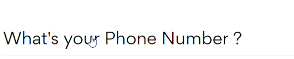

# Fancy Input
Fancy Input is a jQuery plugin that you can use it for text input and make theme look fancy and elegant  text input 


## Setup

1- Make sure **jQuery** is included on top of **fancyinput.min.js**
```html
<script src="js/jquery-3.3.1.min.js"></script>
```

2- Include both CSS and JS files

```html
<link rel="stylesheet" href="css/fancyinput.css">
<script src="js/fancyinput.min.js"></script>
```

## Definition

HTML:
```html
<div class="medium input fancy">
    <div class="label">
        <label>Label</label>
    </div>
    <input type="text" placeholder="Input">
</div>
```
jQuery:
```js
$('.fancy.input').fancyInput();
```

## Sizes
Use the following classes to set the input size : `.small .medium .large .big .massive .epic`
- Example

```html
<div class="large input fancy">
    <div class="label">
        <label>Label</label>
    </div>
    <input type="text" placeholder="Input">
</div>
```

## Settings

- Example 
```js
$('.fancy.input').fancyInput({
    darkColor: 'purple',
    lightColor: '#F6C333',
    borderSize: '5px',
    margin: 20,
    event: 'keydown',
    callback: function (input, label, characterSize, width) {
    alert('From callback : check your console');
    console.log({
        input,
        label,
        characterSize,
        width,
        inputValue:input.val(),
        stringLength:input.val().length,
      });
    }
});
```


- **Style**

| Settings   	| Default 	| Description        	| Type/Unit   	|
|------------	|---------	|--------------------	|--------	|
| `lightColor`| `#f7f7f7`	| Border light color 	| String 	|
| `darkColor`	| `black`  	| Border dark color  	| String 	|
| `borderSize`| `3px`  	| Border Size  	| px 	|


- **Behavior**

| Settings   	| Default 	| Description        	| Type/Unit   	|
|------------	|---------	|--------------------	|--------	|
| `margin`    | `0`	      | How much the border will be ahead of the input text 	| Int 	|
| `event`	| keyup   	| Event to start the border animation    	| String 	|
| `duration`	| `200`   	| Event to start the border animation    	| ms 	|
| `compact`	| `true`   	| The border won't shrink if set to `false`    	| Boolean  	|
| `validation`	| `false`   	| When using validation, setting this to `true` makes the input return to the neutral state when cleared    	| Boolean  	|

- **Callbacks**

| Settings   	| Description        	| Type/Unit|
|------------	|--------------------	|--------	|
| `callback`| Is called when the border animation is started  	| Function 	|
| `onBlur`	| Is called when the input is blured  	| Function 	|

- **Validation**

When using a validation strategy you can use the following classes to style the input : `.error .warning .success .info`

- Example 

```html
<div class="success medium input fancy">
    <div class="label">
        <label>Label</label>
    </div>
    <input type="text" placeholder="Input">
</div>
```

- Set `Validation` to `true` so the input returns to the neutral state when cleared

```js
$('.fancy.input').fancyInput({validation:true});
```

